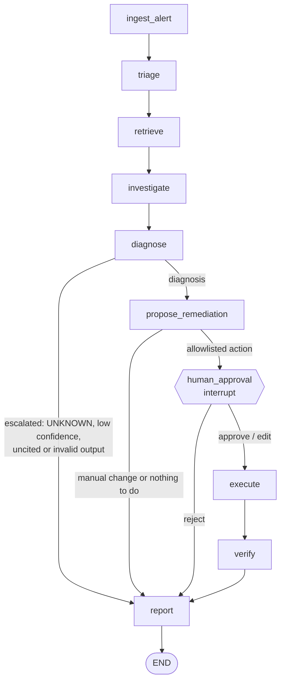

# The OpsPilot agent

The agent turns an alert into a cited diagnosis, a remediation proposal, a human decision,
and an incident report. It is a LangGraph `StateGraph` with a fixed set of nodes
([ADR-0009](adr/0009-state-machine-over-free-form-react.md)), runs on `qwen3:4b` through
Ollama ([ADR-0011](adr/0011-small-model-strategies.md)), and pauses for a human before any
change ([ADR-0010](adr/0010-human-in-the-loop-approval.md)).

```bash
uv run opspilot investigate --scenario oom-payments --mode replay     # recorded cluster
uv run opspilot investigate --alert-file alert.json --mode live       # real cluster
uv run opspilot resume <incident-id> --decision approve --approver <you>
uv run opspilot runs list
uv run opspilot runs show <incident-id>
```

## Graph



| node | model? | what it does |
|---|---|---|
| `ingest_alert` | no | Normalizes Alertmanager JSON, a plain dict or free text into an `Alert`; scans it for prompt injection. |
| `triage` | yes | Affected service and namespace, symptom, 1-3 candidate categories, 2-3 search queries. Falls back to the alert labels if the output is unusable. |
| `retrieve` | no | Hybrid RAG over the knowledge base (top 6 chunks) and the runbooks' quick checks as hints. Retrieved text is scanned for injection. |
| `investigate` | yes | Bounded loop over the read-only MCP tools: one call per turn, at most 8 calls. |
| `diagnose` | yes | `Diagnosis` with category, component, summary, confidence, alternatives, and citations of evidence (`E1..`) and sources (`R1..`). |
| `propose_remediation` | yes | Picks parameters for an action the guards allow, or writes a manual change. Live mode adds a server-side dry run. |
| `human_approval` | no | `interrupt()`: the run is checkpointed and waits for an `ApprovalDecision`. |
| `execute` | no | Mints a single-use approval token from the decision and calls the actions server. Replay never executes. |
| `verify` | no | Polls the Deployment and its pods until they are healthy or 90 s pass. |
| `report` | yes (follow-ups only) | Markdown report in `runs/<incident>/report.md`; the model writes only the follow-up list. |

## State

`IncidentState` (`agent/state.py`) is a Pydantic model checkpointed after every node in
`data/checkpoints.sqlite`:

- inputs: `incident_id`, `mode` (`live` / `replay`), `use_rag`, `raw_alert`, `started_at`
- understanding: `alert`, `triage`, `retrieved` (chunks), `hints`
- `evidence`: append-only list of `Evidence(id, tool, args, summary, excerpt, error)`
- decision path: `diagnosis`, `escalation_reason`, `proposal`, `approval`,
  `action_result`, `verification`, `report`
- `security_flags` and `errors`: append-only
- `metrics`: tokens in/out, LLM calls, tool calls, per-node latency

Append-only fields use `operator.add` reducers, so no node can remove what an earlier node
found. Checkpointed types are allowlisted for deserialization, and a test fails if a new
state type is missing from the list.

## Prompts

Prompts live in `src/opspilot/prompts/*.md`. Each starts with a `version:` line and has the
five sections Role, Retrieved content, Instructions, Examples, Critical reminders, which
`load_prompt` checks. Every run logs the prompt version and a SHA-256 prefix per node to
`runs/<incident>/events.jsonl`.

| prompt | version | used by |
|---|---|---|
| `triage.md` | triage-v1 | `triage` |
| `investigate.md` | investigate-v2 | `investigate` (next tool call) |
| `log_summary.md` | log-summary-v1 | `investigate` (long logs only) |
| `diagnose.md` | diagnose-v1 | `diagnose` |
| `propose.md` | propose-v1 | `propose_remediation` |
| `report.md` | report-v1 | `report` (follow-ups) |

Examples in the prompts use made-up services (`search-api`, `worker-api`, `cart-api`) and
namespaces. A unit test fails if a prompt mentions a demo service, a fault value or an
expected answer.

## Guardrails

| risk | guard | where |
|---|---|---|
| A change without a person deciding | Routing reaches `execute` only after an `approve` or `edit` decision; the token is minted in `execute` from that decision; live runs refuse a decision given before the proposal is shown. | `graph.py`, `nodes/resolution.py`, `agent/cli.py` |
| The model invents an action | Category-to-action allowlist; `rollback` only after a rollout in the last 2 hours; arguments validated by the actions server's own schema and bounds. Anything else becomes a manual change or a safe default. | `guards.py` |
| Edits that change the action | An edit may change parameters only; the result is validated again; invalid edits become rejections. | `nodes/resolution.py` |
| Prompt injection | Untrusted text is wrapped in `<untrusted_data>`; alerts, tool output and documents are scanned (documents only for instruction patterns, since runbooks legitimately contain `kubectl` commands and links). A proposal that matches an injected request is withdrawn. | `guards.py`, `prompts.py` |
| Uncited or invented claims | Every `E`/`R` id cited must exist; at least one evidence citation is required. One repair turn, then escalation. | `guards.py`, `nodes/resolution.py` |
| Guessing | `UNKNOWN` or confidence below 0.5 escalates to a human with the evidence so far. | `guards.py` |
| A diagnosis the evidence contradicts | A pod-level category (OOM, image pull, probes, config, ...) whose component has only ready, never-restarted pods gets one repair turn, then escalates ("no active fault found" when every pod is healthy). | `guards.py`, `nodes/resolution.py` |
| Runaway runs | 8 tool calls, repeated calls blocked, 2 repair turns per structured output, 150 s per model call, 360 s per run, 90 s of verification. | `deps.py` |

Tests for these paths are in `tests/unit/test_agent_graph.py`, `test_guards.py` and
`test_agent_resolution.py`.

## Failure handling

- **Invalid structured output:** the validation error is quoted back to the model (up to
  two repair turns), then a JSON object is extracted from the raw text; if that also fails
  the node uses its fallback: alert labels for triage, a skipped turn for investigation (its turns are capped),
  escalation for diagnosis, a safe default action for remediation, a fixed follow-up list
  for the report.
- **Tool errors:** become evidence (`error=true`) with the server's hint, so the model can
  choose a different call.
- **Timeouts:** each model call is limited by the smaller of 150 s and the run's time left
  (at least 1 s). Investigation stops early when less than a third of a model call's
  budget remains; later calls that run out of time take their fallback, so a run that
  hits the deadline ends with an escalation, not a hang.
- **Process restarts:** the run resumes from the last checkpoint with
  `opspilot resume <incident>`; the time spent waiting for a human does not count against
  the run budget.

## Techniques for a 4B model

Measured on an M-series Mac with 8 GB, `qwen3:4b` (Qwen3-4B-2507) via Ollama. Details and
numbers in [ADR-0011](adr/0011-small-model-strategies.md).

1. **Code does the routine work.** Routing, retrieval, evidence summaries, guards,
   execution, verification and the report layout are deterministic; the model makes five
   kinds of judgement call.
2. **Constrained JSON instead of native tool calls.** Each investigation step is a JSON
   object whose `tool` field is an enum of the real tools, generated with Ollama's JSON
   schema mode and thinking off. Native tool calls with thinking on took about 85 s per
   step; a JSON step takes 7-9 s.
3. **Scaffolding in the prompt.** The investigation prompt lists the calls already made
   and up to four suggested next calls computed from the evidence: endpoints of services
   named as `host:port` in error logs, unhealthy pods (the affected service's and
   restarted ones first, with previous logs for restarts), then the Deployment, its
   rollout history and events. After two blocked repeats the top suggestion runs
   automatically.
4. **Deterministic evidence summaries.** Tool output is summarized by code per tool; the
   model sees short summaries and excerpts with `E` ids instead of raw JSON. The model
   only summarizes long logs.
5. **Defaults computed from the cluster state.** The remediation prompt lists each allowed
   action with default parameters (for memory, 4x the current limit, at most 512Mi), so the
   model confirms or adjusts numbers instead of inventing them.
6. **Repair, then fall back.** Validation errors go back to the model once or twice; every
   node has a non-model fallback. Mistakes that code can fix safely are fixed without a
   model call (E- and R-ids in the wrong reference field are moved).
7. **Small budgets per role.** Output token limits per role (256 tokens for a tool choice,
   700 for a diagnosis) and a fixed seed with temperature 0.

## Observability

- `runs/<incident>/events.jsonl`: node start/end with latency and token deltas, prompt
  versions, tool calls (blocked and automatic ones too), retrieval ids, approvals.
- `runs/<incident>/state.json`: the final state; `run.json`: how the run was started.
- `OPSPILOT_TRACING=1` with the optional `tracing` dependency group sends OpenTelemetry
  traces to a local Arize Phoenix: `uv sync --group tracing`, then
  `docker compose -f infra/docker-compose.yml --profile tracing up -d phoenix` and open
  http://localhost:6006.
