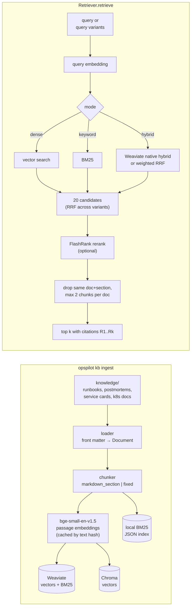

# Retrieval (hybrid RAG)

OpsPilot answers "what is going on and what do we usually do about it?" from a small,
curated knowledge base. This page describes how documents become cited search results
and how well that works.

## Pipeline



## Knowledge base

52 documents under `knowledge/`, validated by `scripts/validate_kb.py` (front-matter
schema, id conventions, categories, internal links, runbook template, scenario runbook
ids) in CI.

| type | count | ids | notes |
|---|---|---|---|
| runbook | 22 | `rb-<slug>` | one per root-cause category (14) plus 8 realistic distractors |
| postmortem | 10 | `pm-YYYY-MM-<slug>` | includes two OOM incidents with different causes (leak vs config) |
| service card | 4 | `svc-<service>` | owner, dependencies, ports, required env, normal usage, SLOs |
| Kubernetes docs | 16 | `k8s-<slug>` | CC BY 4.0, fetched at a pinned commit by `scripts/fetch_k8s_docs.py` |

Ids never change once written: eval queries and scenario ground truth reference them.

## Chunking

- **`markdown_section` (default).** Split on H1–H3 headings (headings inside code fences
  are ignored), then recursively on paragraph, line, sentence and word boundaries to
  about 400 tokens with about 60 tokens of overlap. Each chunk starts with a contextual
  header, `Title > Section > Subsection`, so a chunk that only says "Do not delete the
  Deployment" still carries which runbook it belongs to.
- **`fixed` (baseline).** 800-character windows with 100 characters of overlap.
- Token counts are estimated as characters / 4. That keeps chunking deterministic and
  free of model downloads; at a 400-token target the chunks stay under bge-small's
  512-token input limit.
- `chunk_id = sha1(doc_id, section path, index)`, so re-ingesting produces identical ids.

The corpus yields 740 section chunks and 741 fixed chunks.

## Embeddings

`BAAI/bge-small-en-v1.5` (384 dimensions) through fastembed, on CPU. Documents use
passage embeddings and queries use query embeddings (bge's retrieval instruction).
Passage vectors are cached in SQLite under `data/cache/` by `sha1(model, text)`, so
re-ingesting is cheap. Texts are embedded in length-sorted batches of 16: one batch of
hundreds of long chunks is padded to 512 tokens and needs gigabytes for attention,
which pushed this 8 GB laptop into swap.

## Stores, keyword search and hybrid fusion

Every store gets the same chunks and the same vectors (ADR-0005).

- **Weaviate** stores self-provided vectors and runs BM25 on the chunk text. Hybrid
  search is native, using relative score fusion with `alpha` (1 = vectors only,
  0 = keywords only).
- **Chroma** handles dense search; keyword search is a `rank_bm25` index persisted
  next to it.
- **Pinecone** (optional, only with `PINECONE_API_KEY`) works the same way as Chroma.
- For Chroma and Pinecone, hybrid is **weighted Reciprocal Rank Fusion**:

  `score(d) = alpha / (60 + rank_dense(d)) + (1 - alpha) / (60 + rank_bm25(d))`

  RRF only uses ranks, so it needs no score normalisation between cosine similarity and
  BM25. The constant 60 damps the influence of the very top ranks. The same function
  fuses results from several query variants.

## Reranking

`FlashRank` with `ms-marco-MiniLM-L-12-v2`, a cross-encoder that reads the query and
each candidate together. It reorders the 20 candidates before dedupe and citation. It
is optional because it costs about a second per query on this laptop (see below).

## Results

60 queries in `evals/retrieval/queries.jsonl`: 40 symptom descriptions, 10 pasted log
lines or kubectl output, 10 hard queries that sit next to a distractor (for example
"502 from the ingress" must find the ingress runbook, not the Service misconfiguration
one). Relevance is graded (primary 2, secondary 1). `opspilot eval check-queries` rejects
any query that copies more than 60% of its primary document's title.

Selected rows (full matrix: [`evals/retrieval/RESULTS.md`](../evals/retrieval/RESULTS.md)):

| store | chunker | mode | rerank | R@1 | R@5 | MRR@10 | nDCG@5 | p95 ms |
|---|---|---|---|---|---|---|---|---|
| chroma | markdown_section | hybrid α=0.5 | on | 0.667 | 0.950 | 0.789 | **0.857** | 1912 |
| weaviate | markdown_section | hybrid α=0.5 | on | 0.650 | 0.950 | 0.781 | 0.852 | 1314 |
| **weaviate** | **markdown_section** | **hybrid α=0.5 (default)** | **off** | 0.583 | 0.933 | 0.746 | **0.817** | **42** |
| weaviate | markdown_section | dense | on | 0.633 | 0.883 | 0.740 | 0.804 | 4506 |
| chroma | markdown_section | hybrid α=0.5 | off | 0.550 | 0.933 | 0.699 | 0.784 | 15 |
| weaviate | markdown_section | keyword | off | 0.583 | 0.883 | 0.711 | 0.778 | 7 |
| weaviate | markdown_section | dense | off | 0.483 | 0.783 | 0.612 | 0.672 | 14 |


Findings:

- **Hybrid + rerank beats dense-only on nDCG@5** (0.852 vs 0.672 on Weaviate), and
  hybrid alone already gets most of the way (0.817).
- **Reranking** lifts every mode, most of all dense search (+0.13) and the hard
  near-distractor queries (hybrid: 0.695 → 0.787). It is too slow to be the default on
  this laptop.
- **Weaviate's native hybrid beats RRF** on identical vectors (0.817 vs 0.784).
- **Where it still fails:** in 3 of the 4 queries the default misses at Recall@5, a
  postmortem about the same incident outranks the runbook.

Latency was measured end to end (query embedding, search, reranking) after a warm-up
query, while the laptop was swapping heavily, so the absolute numbers are upper bounds.
The default and its rationale are in ADR-0004.

## Using it

```bash
make infra-up                                   # Weaviate on localhost:8090 (gRPC 50052)
uv run opspilot kb ingest                       # all available stores and both chunkers
uv run opspilot kb stats
uv run opspilot kb search "orders and inventory both NotReady, call to redis failed"
uv run opspilot kb search "exit code 137 after deploy" --store chroma --rerank
uv run opspilot eval check-queries
uv run opspilot eval retrieval --configs all    # full matrix, about 25 minutes here
```
