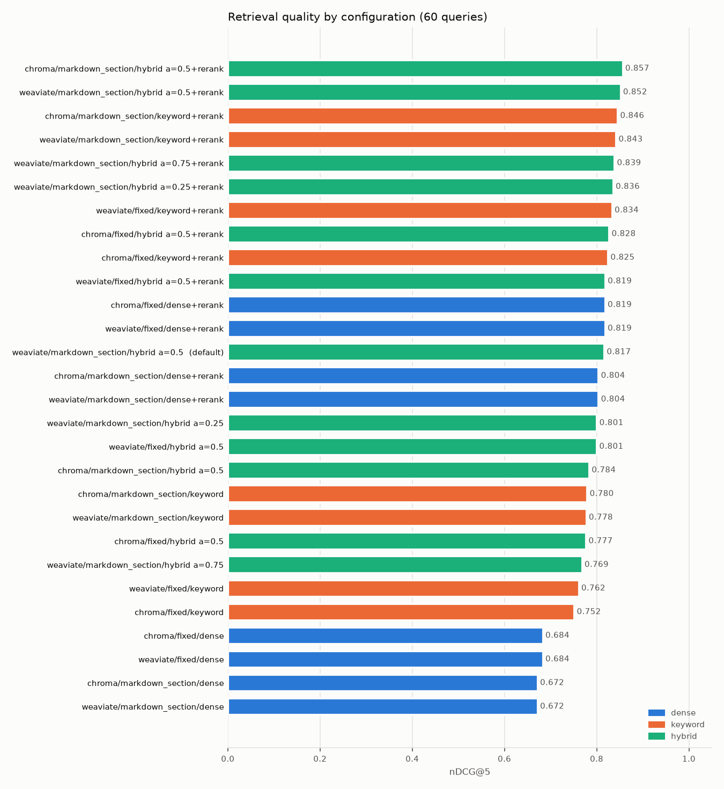

# Retrieval evaluation results

Generated by `opspilot eval retrieval --configs all` on 2026-10-05 (arm64 Darwin, 3.12.15).
60 queries (40 symptom, 10 log snippet, 10 hard near-distractor) over 52 documents. Embeddings: `BAAI/bge-small-en-v1.5`; reranker: `ms-marco-MiniLM-L-12-v2` over the top 20 candidates.

Metrics are computed on the ranked list of distinct documents. Recall@k and MRR@10 use the single primary document of each query; nDCG@5 uses graded relevance (primary = 2, secondary = 1). Latency is end-to-end `Retriever.retrieve` time including query embedding and reranking, measured on this laptop after one warm-up query.

| store | chunker | mode | rerank | R@1 | R@3 | R@5 | MRR@10 | nDCG@5 | p50 ms | p95 ms |
|---|---|---|---|---|---|---|---|---|---|---|
| chroma | markdown_section | hybrid α=0.5 | on | 0.667 | 0.917 | 0.950 | 0.789 | 0.857 | 823 | 1912 |
| weaviate | markdown_section | hybrid α=0.5 | on | 0.650 | 0.917 | 0.950 | 0.781 | 0.852 | 668 | 1314 |
| chroma | markdown_section | keyword | on | 0.650 | 0.900 | 0.933 | 0.780 | 0.846 | 954 | 1856 |
| weaviate | markdown_section | keyword | on | 0.650 | 0.900 | 0.933 | 0.780 | 0.843 | 986 | 1684 |
| weaviate | markdown_section | hybrid α=0.75 | on | 0.650 | 0.883 | 0.917 | 0.772 | 0.839 | 631 | 1039 |
| weaviate | markdown_section | hybrid α=0.25 | on | 0.633 | 0.900 | 0.933 | 0.769 | 0.836 | 774 | 1026 |
| weaviate | fixed | keyword | on | 0.567 | 0.917 | 0.950 | 0.744 | 0.834 | 443 | 650 |
| chroma | fixed | hybrid α=0.5 | on | 0.550 | 0.933 | 0.950 | 0.743 | 0.828 | 449 | 644 |
| chroma | fixed | keyword | on | 0.550 | 0.933 | 0.950 | 0.737 | 0.825 | 435 | 528 |
| weaviate | fixed | hybrid α=0.5 | on | 0.550 | 0.933 | 0.933 | 0.743 | 0.819 | 457 | 624 |
| weaviate | fixed | dense | on | 0.550 | 0.900 | 0.933 | 0.734 | 0.819 | 580 | 984 |
| chroma | fixed | dense | on | 0.550 | 0.900 | 0.933 | 0.734 | 0.819 | 459 | 626 |
| weaviate | markdown_section | hybrid α=0.5 **(default)** | off | 0.583 | 0.917 | 0.933 | 0.746 | 0.817 | 18 | 42 |
| weaviate | markdown_section | dense | on | 0.633 | 0.867 | 0.883 | 0.740 | 0.804 | 855 | 4506 |
| chroma | markdown_section | dense | on | 0.633 | 0.867 | 0.883 | 0.740 | 0.804 | 773 | 1899 |
| weaviate | markdown_section | hybrid α=0.25 | off | 0.583 | 0.900 | 0.917 | 0.732 | 0.801 | 8 | 14 |
| weaviate | fixed | hybrid α=0.5 | off | 0.533 | 0.883 | 0.933 | 0.715 | 0.801 | 10 | 14 |
| chroma | markdown_section | hybrid α=0.5 | off | 0.550 | 0.817 | 0.933 | 0.699 | 0.784 | 9 | 15 |
| chroma | markdown_section | keyword | off | 0.583 | 0.817 | 0.883 | 0.714 | 0.780 | 1 | 1 |
| weaviate | markdown_section | keyword | off | 0.583 | 0.817 | 0.883 | 0.711 | 0.778 | 3 | 7 |
| chroma | fixed | hybrid α=0.5 | off | 0.467 | 0.833 | 0.950 | 0.666 | 0.777 | 7 | 13 |
| weaviate | markdown_section | hybrid α=0.75 | off | 0.550 | 0.783 | 0.917 | 0.691 | 0.769 | 10 | 17 |
| weaviate | fixed | keyword | off | 0.533 | 0.800 | 0.883 | 0.683 | 0.762 | 1 | 5 |
| chroma | fixed | keyword | off | 0.500 | 0.800 | 0.883 | 0.667 | 0.752 | 1 | 1 |
| weaviate | fixed | dense | off | 0.383 | 0.767 | 0.883 | 0.578 | 0.684 | 8 | 14 |
| chroma | fixed | dense | off | 0.383 | 0.767 | 0.883 | 0.578 | 0.684 | 6 | 11 |
| weaviate | markdown_section | dense | off | 0.483 | 0.700 | 0.783 | 0.612 | 0.672 | 8 | 14 |
| chroma | markdown_section | dense | off | 0.483 | 0.700 | 0.783 | 0.612 | 0.672 | 6 | 9 |

## Default configuration

Best nDCG@5 with p95 under 300 ms: **weaviate/markdown_section/hybrid a=0.5** (nDCG@5 0.817, R@5 0.933, p95 42 ms). See ADR-0004.

## By query type (nDCG@5)

| config | symptom | log | hard |
|---|---|---|---|
| chroma/markdown_section/hybrid a=0.5+rerank | 0.883 | 0.824 | 0.787 |
| weaviate/markdown_section/hybrid a=0.5+rerank | 0.868 | 0.855 | 0.787 |
| chroma/markdown_section/keyword+rerank | 0.879 | 0.851 | 0.709 |
| weaviate/markdown_section/keyword+rerank | 0.879 | 0.841 | 0.699 |
| weaviate/markdown_section/hybrid a=0.75+rerank | 0.845 | 0.857 | 0.796 |
| weaviate/markdown_section/hybrid a=0.25+rerank | 0.874 | 0.810 | 0.713 |
| weaviate/fixed/keyword+rerank | 0.850 | 0.874 | 0.731 |
| chroma/fixed/hybrid a=0.5+rerank | 0.842 | 0.863 | 0.733 |
| chroma/fixed/keyword+rerank | 0.845 | 0.844 | 0.726 |
| weaviate/fixed/hybrid a=0.5+rerank | 0.838 | 0.867 | 0.694 |
| weaviate/fixed/dense+rerank | 0.829 | 0.874 | 0.724 |
| chroma/fixed/dense+rerank | 0.829 | 0.874 | 0.724 |
| weaviate/markdown_section/hybrid a=0.5 | 0.836 | 0.862 | 0.695 |
| weaviate/markdown_section/dense+rerank | 0.800 | 0.850 | 0.776 |
| chroma/markdown_section/dense+rerank | 0.800 | 0.850 | 0.776 |
| weaviate/markdown_section/hybrid a=0.25 | 0.819 | 0.862 | 0.667 |
| weaviate/fixed/hybrid a=0.5 | 0.823 | 0.825 | 0.686 |
| chroma/markdown_section/hybrid a=0.5 | 0.801 | 0.882 | 0.620 |
| chroma/markdown_section/keyword | 0.800 | 0.782 | 0.696 |
| weaviate/markdown_section/keyword | 0.794 | 0.791 | 0.701 |
| chroma/fixed/hybrid a=0.5 | 0.803 | 0.829 | 0.625 |
| weaviate/markdown_section/hybrid a=0.75 | 0.761 | 0.864 | 0.705 |
| weaviate/fixed/keyword | 0.770 | 0.807 | 0.681 |
| chroma/fixed/keyword | 0.760 | 0.811 | 0.662 |
| weaviate/fixed/dense | 0.732 | 0.702 | 0.473 |
| chroma/fixed/dense | 0.732 | 0.702 | 0.473 |
| weaviate/markdown_section/dense | 0.647 | 0.787 | 0.658 |
| chroma/markdown_section/dense | 0.647 | 0.787 | 0.658 |

